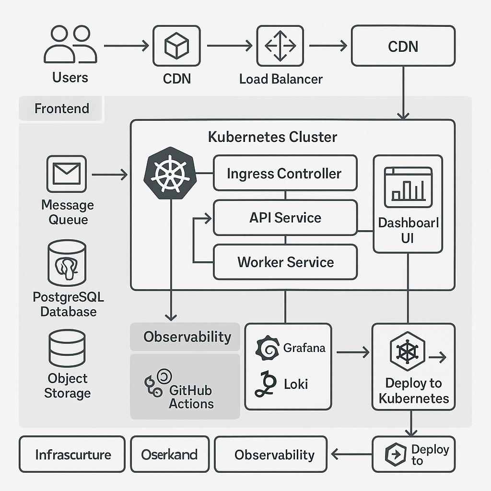

# Cloud-Native Event Processing Platform

A **production-grade, cloud-native DevOps platform** demonstrating real-world engineering practices across **AWS, Kubernetes, Terraform, CI/CD, observability, and security**.

This project showcases how to design, deploy, and operate a **scalable event-driven system** using modern DevOps and platform engineering tools.

---
Architecture Diagram


## 🚀 Live Demo 

🔗 **Coming soon** — available once infrastructure and frontend deployment are complete.

---
## 📂 Repository Structure

```bash
devops-platform/
├── infra/                # Terraform IaC (AWS VPC, EKS, RDS, IAM, ECR)
│   ├── modules/          # Reusable Terraform modules
│   └── envs/             # Environment-specific configs (staging, prod)
├── platform-config/      # Kubernetes manifests & Helm charts
├── services/             # Microservices
│   ├── api-service/      # Event ingestion API
│   ├── worker-service/   # Background SQS consumer
│   └── dashboard-service # Internal service (optional)
├── frontend/             # React + Tailwind UI
├── ci/                   # GitHub Actions workflows
├── observability/        # Prometheus, Grafana, Loki configs
├── docs/                 # Architecture diagrams & documentation
└── README.md
```

---

## 🧩 Architecture Overview

This platform processes incoming events through a **fully decoupled, scalable pipeline**:

1. **Frontend (React + Tailwind, Vercel)**
   Web dashboard for viewing processed events and metrics

2. **API Service**
   Receives incoming requests and publishes messages to SQS

3. **Worker Service**
   Consumes messages from SQS and persists results to PostgreSQL

4. **AWS EKS (Kubernetes)**
   Orchestrates all microservices

5. **AWS SQS**
   Provides asynchronous, reliable event processing

6. **AWS RDS (PostgreSQL)**
   Persistent relational storage

7. **Observability Stack**

   * Prometheus → metrics
   * Grafana → dashboards
   * Loki → centralized logs

8. **CI/CD (GitHub Actions)**
   Automated build, scan, push, and deploy

9. **Terraform**
   Infrastructure as Code for reproducible environments

---

## 🏗️ High-Level Architecture Diagram

📌 **Location:**

```bash
/docs/architecture.png
```

*(Diagram created with draw.io)*

---

## 🛠️ Technology Stack

### ☁️ Cloud & Infrastructure

* AWS (EKS, VPC, RDS, ECR, SQS, IAM, S3)
* Terraform (modular, reusable design)
* Kubernetes (Deployments, Services, Ingress, Helm)

### 🔧 Backend

* Node.js or Python (configurable)
* RESTful API
* Background worker (SQS consumer)

### 🎨 Frontend

* React
* Tailwind CSS
* Recharts / Chart.js
* Hosted on Vercel

### 🔄 CI/CD

* GitHub Actions
* Docker
* Trivy (container security scanning)
* Helm deployments to EKS

### 📊 Observability

* Prometheus (metrics)
* Grafana (dashboards)
* Loki (logs)
* Alertmanager (alerts)

---

## 🔄 CI/CD Pipeline Flow

```text
Git Push / Pull Request
        ↓
GitHub Actions
        ↓
Tests & Lint
        ↓
Docker Build
        ↓
Trivy Security Scan
        ↓
Push Image to AWS ECR
        ↓
Helm Deploy to EKS
```

---

## 🧱 Infrastructure Setup (Terraform)

### 1️⃣ Initialize Terraform

```bash
cd infra/envs/staging
terraform init
```

### 2️⃣ Review the Plan

```bash
terraform plan
```

### 3️⃣ Apply Infrastructure

```bash
terraform apply
```

This provisions:

* VPC (public & private subnets)
* EKS cluster
* RDS PostgreSQL
* ECR repositories
* IAM roles & policies
* SQS queues

---

## 📦 Build & Deploy Services

### Build Locally

```bash
docker build -t api-service ./services/api-service
```

### Deploy to EKS (Helm)

```bash
helm upgrade --install api ./platform-config/charts/app-chart
```

### View Pod Logs

```bash
kubectl logs -l app=api-service
```

---

## 📊 Monitoring & Logging

### Access Grafana

```bash
kubectl port-forward svc/grafana 3000:80 -n observability
```

📊 **Default Dashboards**

* API request latency
* Worker throughput
* Pod CPU & memory usage
* Application logs (via Loki)

---

## 🔐 Security Practices

* IAM least-privilege roles
* GitHub Actions OIDC authentication
* No long-lived AWS credentials
* Container image scanning (Trivy)
* Kubernetes NetworkPolicies
* TLS encryption everywhere
* Secrets managed outside source control

---

## 🧪 Running Locally (Optional)

### API Service

```bash
cd services/api-service
npm install
npm run dev
```

### Worker Service

```bash
cd services/worker-service
npm install
npm run dev
```

### Frontend Dashboard

```bash
cd frontend
npm install
npm run dev
```

---

## 🙌 What This Project Demonstrates

✅ Cloud infrastructure automation (Terraform + AWS).  
✅ Kubernetes orchestration and Helm deployments.  
✅ Production CI/CD pipelines with GitHub Actions.  
✅ Observability (metrics, logs, dashboards).  
✅ Secure cloud-native architecture.  
✅ Event-driven microservices design.  
✅ End-to-end DevOps ownership.  
✅ Real-world production practices

---

## 📌 Roadmap

* [ ] Deploy staging environment
* [ ] Enable HPA (Horizontal Pod Autoscaling)
* [ ] Add Grafana dashboard JSON exports
* [ ] Add unit & integration tests
* [ ] Add distributed tracing (OpenTelemetry)
* [ ] Production environment deployment
